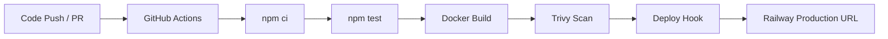

# First Pipeline Challenge

[](https://github.com/PalmChas/M4K-Pipeline/actions/workflows/pipeline.yml)

```text
 __  __ _  _  _       ____  _            _ _            
|  \/  | || || |     |  _ \(_)_ __   ___| (_)_ __   ___ 
| |\/| | || || |_    | |_) | | '_ \ / _ \ | | '_ \ / _ \
| |  | |__   _|__|   |  __/| | |_) |  __/ | | | | |  __/
|_|  |_|  |_|        |_|   |_| .__/ \___|_|_|_| |_|\___|
                             |_|                         
```

Live deployment: [m4k-pipeline-production.up.railway.app](https://m4k-pipeline-production.up.railway.app)

## About
Week 4 Boiler Room Hackathon mission: build a full CI/CD pipeline with tests, Docker image build, Trivy scan and live deployment.

## Architecture


## Endpoints
- `GET /` -> dashboard landing page
- `GET /status` -> service status + timestamp
- `GET /health` -> health check + uptime

## Pipeline Demo GIF


## Team Bios
- 👩‍💻 Driver: Builds app features and keeps commits clean.
- 🧭 Navigator: Owns architecture, docs and delivery flow.
- 🧪 Tester: Breaks assumptions and keeps pipeline green.
- 🔍 Researcher: Investigates errors and optimizes tooling.

## Future Plans
- Add staging and production environments with protected deploys.
- Add Prometheus-style `/metrics` and dashboard graphs.
- Add Slack notifications for failed and successful runs.
- Add chaos test job that randomly restarts the service in staging.

## Status
- All tests passing
- Security scan complete
- Deployed to production

<!-- Careful readers only: try the hidden endpoint /secret -->
